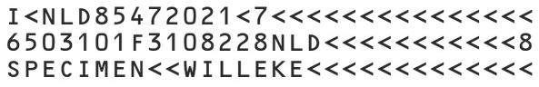

# MRZ Scanner Integration Guide

In this guide, we will guide you to develop a MRZ scanning app with the [`MRZScanner`](https://pub.dev/documentation/dynamsoft_mrz_scanner_bundle_flutter/latest/) component.

`MRZScanner` is a ready-to-use component that allows developers to quickly set up an MRZ scanning app. With the built-in component, it streamlines the integration of MRZ scanning functionality into any application.

## Supported Machine-Readable Travel Document Types

The Machine Readable Travel Documents (MRTD) standard specified by the International Civil Aviation Organization (ICAO) defines how to encode information for optical character recognition on official travel documents.

Currently, the SDK supports three types of MRTD:

> [!NOTE]
> If you need support for other types of MRTDs, our SDK can be easily customized. Please contact support@dynamsoft.com.

### ID (TD1 Size)

The MRZ (Machine Readable Zone) in TD1 format consists of 3 lines, each containing 30 characters.

<div>
   
</div>

### ID (TD2 Size)

The MRZ (Machine Readable Zone) in TD2 format consists of 2 lines, with each line containing 36 characters.

<div>
   
</div>

### Passport (TD3 Size)

The MRZ (Machine Readable Zone) in TD3 format consists of 2 lines, with each line containing 44 characters.

<div>
   
</div>

## Requirements

### Dev tools

* Latest [Flutter SDK](https://flutter.dev/)
* For Android apps: Android SDK (API Level 21+), platforms and developer tools
* For iOS apps: iOS 13+, macOS with latest Xcode and command line tools

### Mobile platforms

* Android 5.0 (API Level 21) and higher
* iOS 13 and higher

## Installation

Run the following commands in the root directory of your flutter project to add `dynamsoft-mrz-scanner-bundle-flutter` into dependencies

```bash
flutter pub add dynamsoft-mrz-scanner-bundle-flutter
```

then run the command to install all dependencies:
```bash
flutter pub get
```

## Camera permissions

The Dynamsoft Capture Vision SDK needs the camera permission to use the camera device, so it can capture from video stream.

### Android

For Android, we have defined camera permission within the SDK, you don't need to do anything.

### iOS

Add this camera permission description to **ios/{projectName}/Info.plist** inside the <dict> element:

```xml
<key>NSCameraUsageDescription</key>
    <string></string>
```

## Build the MRZ Scanner Widget

Now that the package is added, it's time to start building the `MRZScanner` Widget using the SDK.

### Import
To use the MRZScanner API, please import `dynamsoft_mrz_scanner_bundle_flutter` in your dart file:
```dart
import 'package:dynamsoft_mrz_scanner_bundle_flutter/dynamsoft_mrz_scanner_bundle_flutter.dart';
```

### Simplest Example
```dart
import 'package:dynamsoft_mrz_scanner_bundle_flutter/dynamsoft_mrz_scanner_bundle_flutter.dart';

void _launchMrzScanner() async {
  var config = MRZScannerConfig(
    license: "DLS2eyJvcmdhbml6YXRpb25JRCI6IjIwMDAwMSJ9",
  );
  MRZScanResult mrzScanResult = await MRZScanner.launch(config);
  if(mrzScanResult.status == EnumResultStatus.finished) {
    MRZData data = mrzScanResult.mrzData!;
    // do something with the data
  }
}
```

You can call the above function anywhere (e.g., when the app starts, on a button click, etc.) to achieve the effect:
open an MRZ scanning interface, and after scanning is complete, close the interface and return the result.
Following is the simplest example of how to use the `_launchMrzScanner` function:

```dart
import 'package:flutter/material.dart';
import 'package:dynamsoft_mrz_scanner_bundle_flutter/dynamsoft_mrz_scanner_bundle_flutter.dart';

class MyHomePage extends StatefulWidget {
  final String title;
  const MyHomePage({super.key, required this.title});
  @override
  State<MyHomePage> createState() => _MyHomePageState();
}

class _MyHomePageState extends State<MyHomePage> {
  void _launchMrzScanner() async {
    //...
  }

  @override
  Widget build(BuildContext context) {
    return Scaffold(
      appBar: AppBar(title: Text(widget.title)),
      body: Center(
        child: Column(
          mainAxisAlignment: MainAxisAlignment.center,
          children: <Widget>[
            TextButton(
              onPressed: _launchMrzScanner,
              child: const Text("Scan an MRZ"),
            ),
          ],
        ),
      )
    );
  }
}
```

> [!NOTE]
>
>- The license string here grants a time-limited free trial which requires network connection to work.
>- You can request a 30-day trial license via the [Request a Trial License](https://www.dynamsoft.com/customer/license/trialLicense?product=mrz&utm_source=github&package=mobile) link.

### MRZ Scan Result And MRZ Data

`MRZScanResult` structure:

- resultStatus: The status of the MRZ scan result, of type `EnumResultStatus`.
    - finished: The MRZ scan was successful.
    - canceled: The MRZ scanning activity is closed before the process is finished.
    - exception: Failed to start MRZ scanning or an error occurs when scanning the MRZ.
- errorCode: The error code indicates if something went wrong during the MRZ scanning process (0 means no error). Only defined when `resultStatus` is RS_EXCEPTION.
- errorString: The error message associated with the error code if an error occurs during MRZ scanning process. Only defined when `resultStatus` is RS_EXCEPTION.
- data: The parsed MRZ data.
  
`MRZData` structure:

- documentType: The type of document, such as `'ID cards'` or `'passports'`.
- firstName: The first name of the user of the MRZ document.
- lastName: The last name of the user of the MRZ document.
- sex: The sex of the user of the MRZ document.
- issuingState: The issuing state of the MRZ document.
- nationality: The nationality of the user of the MRZ document.
- dateOfBirth: The date of birth of the user of the MRZ document.
- dateOfExpiry: The expiry date of the MRZ document.
- documentNumber: The MRZ document number.
- age: The age of the user of the MRZ document.
- mrzText: The raw text of the MRZ.


### (Optional)Change the MRZScanConfig to meet your needs

```dart

var config = MRZScannerConfig(
  ///The license key required to initialize the MRZ Scanner.
  license: "DLS2eyJvcmdhbml6YXRpb25JRCI6IjIwMDAwMSJ9",
  
  ///Determines whether the torch (flashlight) button is visible in the scanning UI.
  ///Set to true to display the torch button, enabling users to turn the flashlight on/off. Default is true.
  isTorchButtonVisible: true,
  
  ///Specifies the type of document to be scanned for MRZ.
  ///This property accepts values defined in the EnumDocumentType, such as `EnumDocumentType.all`, `EnumDocumentType.id`, or E`numDocumentType.passport`.
  ///It helps the scanner to optimize its processing based on the expected document type.
  ///Default is EnumDocumentType.all.
  documentType: EnumDocumentType.all,

  ///Specifies if a beep sound should be played when an MRZ is successfully detected.
  ///Set to true to enable the beep sound, or false to disable it. Default is false.
  isBeepEnabled: false,

  ///Determines whether the close button is visible on the scanner UI.
  ///This button allows users to exit the scanning interface. Default is true.
  isCloseButtonVisible: true,

  ///Specifies whether the camera toggle button is displayed.
  ///This button lets users switch between available cameras (e.g., front and rear). Default is false.
  isCameraToggleButtonVisible: false,

  ///Determines whether a guide frame is visible during scanning.
  ///The guide frame assists users in properly aligning the document for optimal MRZ detection.
  ///When set to true, a visual overlay is displayed on the scanning interface. Default is true.
  isGuideFrameVisible: true,


  ///Specifies the template configuration for the MRZ scanner.
  ///This can be either a file path or a JSON string that defines various scanning parameters.
  ///Default is undefined, which means the default template will be used.
  templateFile: "JSON template string",
);
```

## Run the project

**Android:**

```
flutter run -d <DEVICE_ID>
```

You can get the IDs of all connected devices with `flutter devices`.

**iOS:**

Install Pods dependencies:

```
cd ios/
pod install --repo-update
```

Open the **workspace**(!) `ios/Runner.xcworkspace` in Xcode and adjust the *Signing / Developer Account* settings. Then, build and run the app in Xcode.

If everything is set up _correctly_, you should see your new app running on your device.

## Full Sample Code

The full sample code is available [here](./ScanMRZ).

## License

- You can request a 30-day trial license via the [Request a Trial License](https://www.dynamsoft.com/customer/license/trialLicense?product=mrz&utm_source=github&package=mobile) link.

## Contact

https://www.dynamsoft.com/company/contact/
